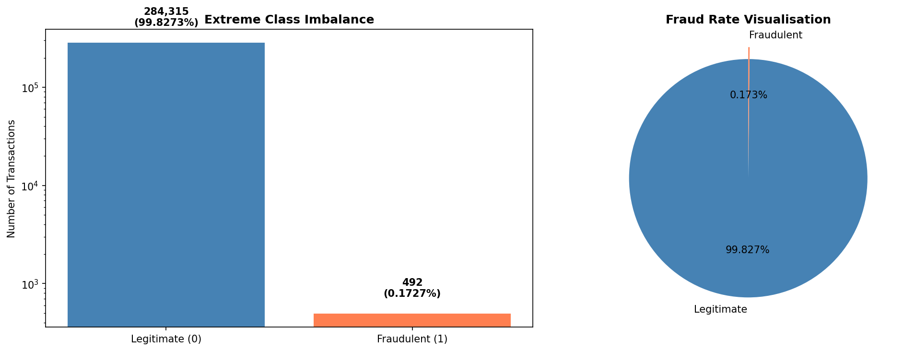
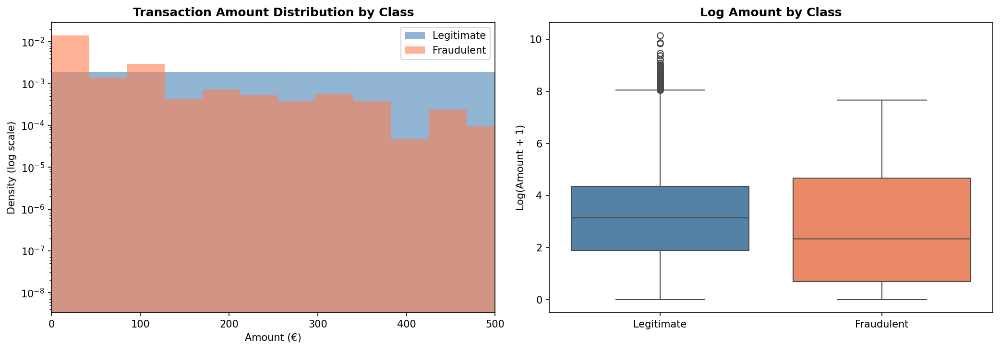
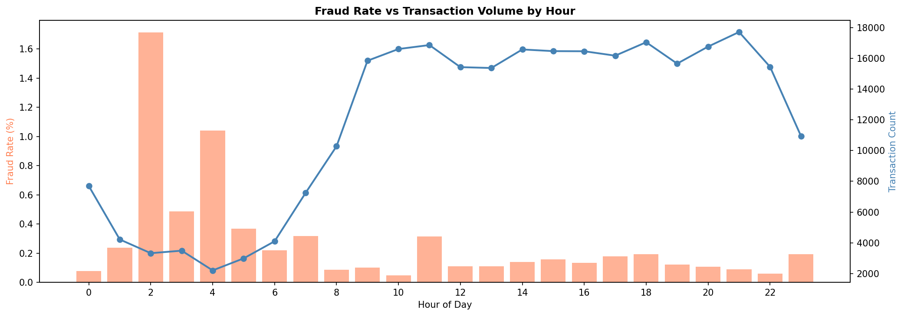
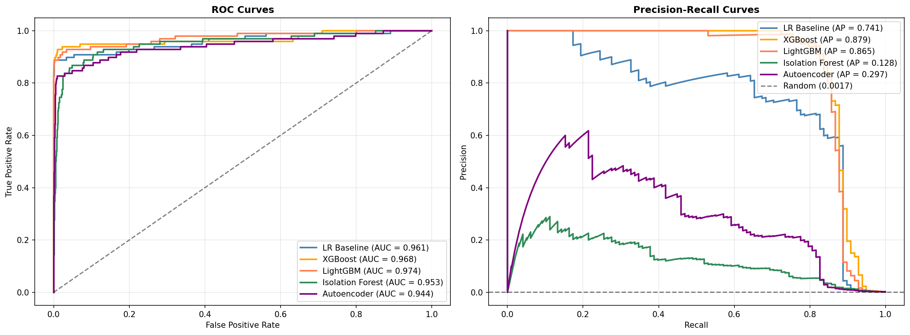
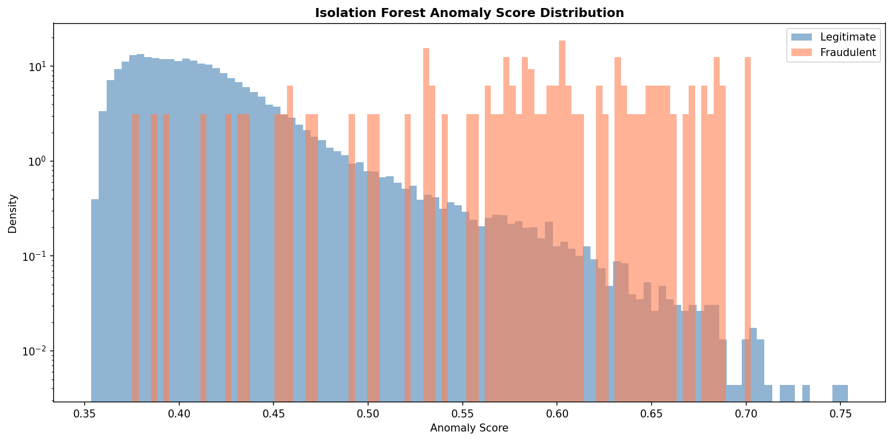
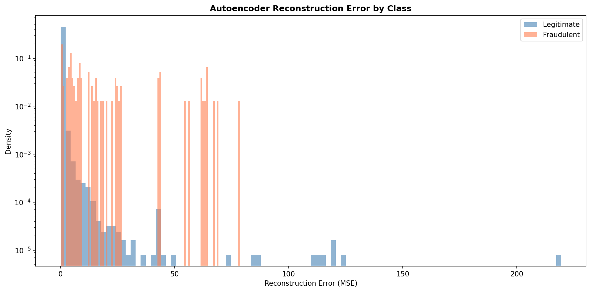
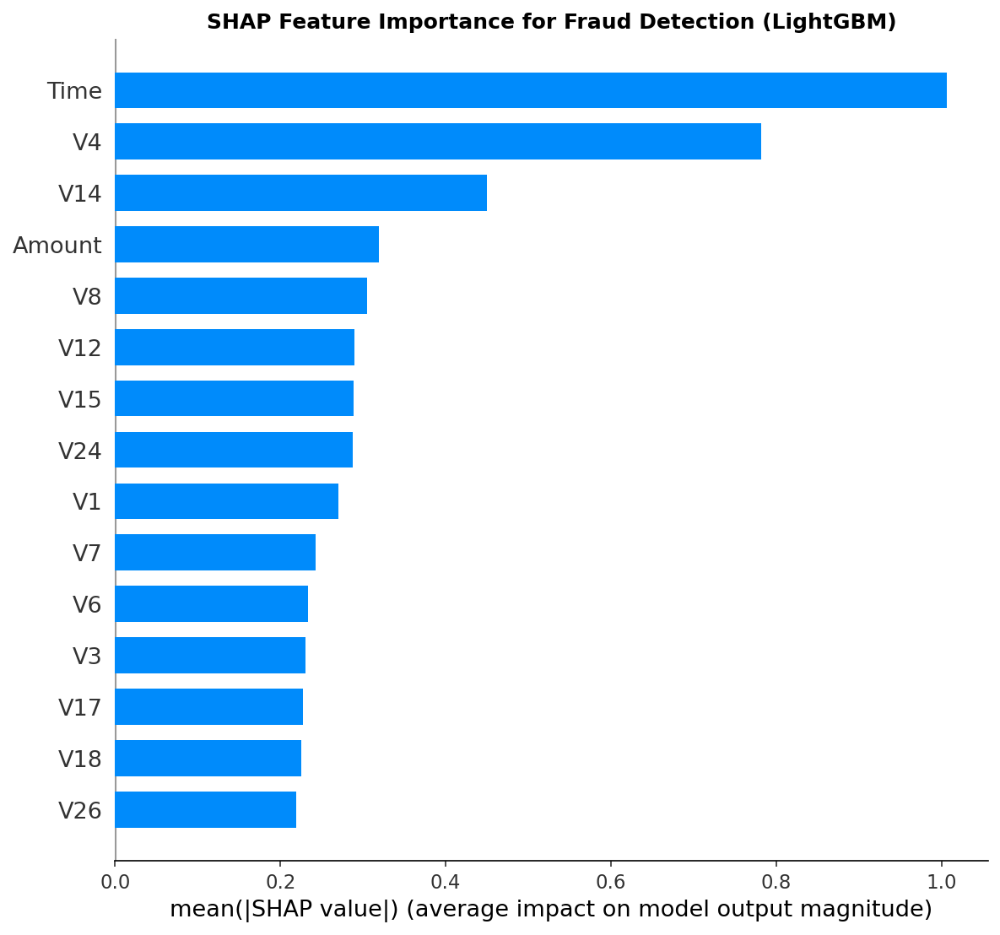
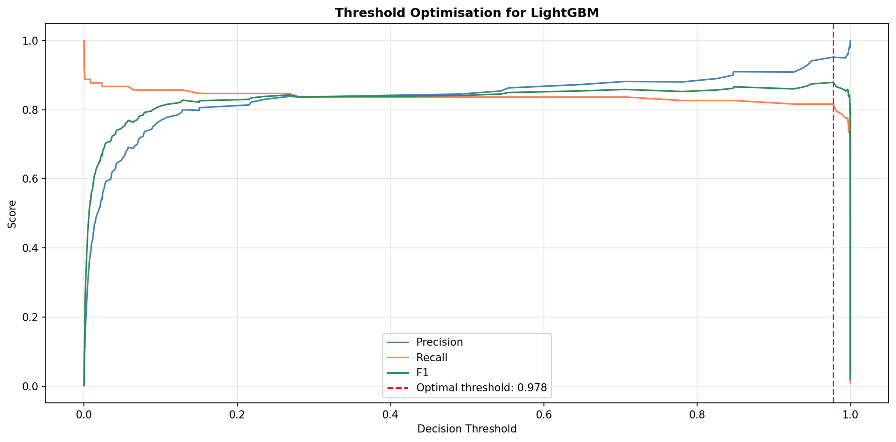
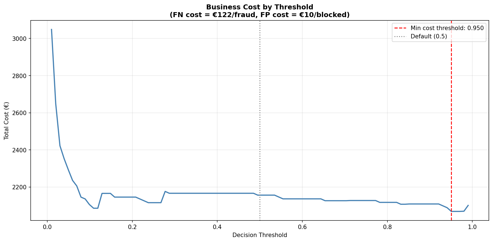

# 🛡️ Financial Fraud Detection with Class Imbalance Handling

Detecting fraudulent credit card transactions at a fraud rate of **0.17%** — where a model that predicts "no fraud" for every transaction achieves 99.83% accuracy and catches nothing. This project compares five modelling approaches spanning supervised and unsupervised paradigms, tackles extreme class imbalance with SMOTE variants and class weighting, and optimises the decision threshold using business cost rather than F1 or default 0.5.

*Built around honest evaluation: it reports PR-AUC as the primary metric (not the misleading 99.8% accuracy or inflated ROC-AUC), documents that SMOTE variants **hurt** PR-AUC on this dataset compared to no rebalancing, and derives the operating threshold from a €-cost calculation rather than convention. Same tabular ML backbone as my [credit-risk explainable-AI project](https://github.com/TochiOkafor/credit-risk-explainable-ai), applied to the real-time fraud domain.*

---

## Why This Matters

Fraud detection is one of the highest-volume ML applications in fintech. Every major payment processor, bank, and e-commerce platform runs continuous fraud scoring — **Stripe, Wise, Revolut, Monzo, HSBC, Barclays, Adyen, PayPal** — because a single missed fraud is a direct loss, and a single false positive is a frustrated customer. The technical challenge is not model complexity but **extreme class imbalance**: real fraud rates sit at 0.1–0.2%, so standard metrics collapse and standard thresholds are wrong by default.

This project treats those constraints as the design brief. Every choice — the primary metric, the rebalancing strategy, the decision threshold — is made explicitly with the imbalance in mind, and every finding is presented with the operating cost it would carry in production.

---

## Project Overview

**Objective:** Detect fraudulent transactions in real time, and select the operating point that minimises total business cost rather than maximises a generic classification metric.

**Approach:**
- **Baseline:** Logistic Regression (no rebalancing)
- **Rebalancing comparison:** SMOTE, BorderlineSMOTE, ADASYN — applied to Logistic Regression
- **Supervised models:** XGBoost + LightGBM with `scale_pos_weight` / `class_weight='balanced'`
- **Unsupervised anomaly detection:** Isolation Forest + PyTorch Autoencoder trained on legitimate transactions only
- **Threshold optimisation:** F1-optimal and cost-optimal thresholds
- **Cost-benefit analysis:** total business cost in € as a function of decision threshold
- **Explainability:** SHAP `TreeExplainer` on the champion model

---

## Dataset

**Source:** [Credit Card Fraud Detection](https://www.kaggle.com/datasets/mlg-ulb/creditcardfraud) (Kaggle, Machine Learning Group — ULB)

- **284,807 credit card transactions** from European cardholders (September 2013)
- **30 features:** `Time`, `Amount`, and 28 anonymised PCA-transformed features (`V1`–`V28`)
- **Fraud rate: 0.172%** (492 fraud cases in 284,807 transactions) — extreme imbalance
- Real-world transaction data, anonymised for privacy — the industry-standard benchmark for fraud ML

---

## Data Exploration

### Class Imbalance

The core challenge of the problem in one image. On a linear scale the fraud bar would be invisible — the log-scale bar chart is the only way to make the 500× imbalance visible. This is precisely why accuracy is a useless metric here: a model that predicts "legitimate" for every transaction scores **99.827%** and catches zero fraud. Every evaluation in this project uses ROC-AUC, PR-AUC, precision, and recall — never accuracy.

### Transaction Amount by Class

Fraudulent transactions have a **higher mean** (€122 vs €88) but a **lower median** (€9 vs €22) than legitimate ones. That is not a contradiction — it is a real fraud pattern. Attackers verify stolen cards with tiny "test" charges before larger attempts, so fraud concentrates at small amounts but is pulled up on the mean by a long tail of larger successful attempts. The distinct shape gives the model a genuine signal to learn from.

### Fraud Rate by Hour

Fraud rate peaks at **1.7% around 02:00** and 1.0% around 04:00 — roughly **10× the daytime fraud rate**. Legitimate transactions cluster during waking hours (8 AM–10 PM, ~17,000/hour), while fraud remains roughly constant across the clock in absolute terms. The result is a proportional spike overnight: attackers work when detection teams and customers are asleep. This inverse relationship between volume and fraud rate is one of the strongest signals in the dataset.

---

## Methodology

### 1. Preprocessing
- **Feature scaling:** `StandardScaler` on all 30 features (essential for Logistic Regression and the autoencoder)
- **PCA features:** `V1`–`V28` are already PCA-transformed by the dataset providers for privacy, so no additional dimensionality reduction was applied
- **Stratified 80/20 split:** preserves the 0.172% fraud rate in both train and test sets

### 2. Class Imbalance Handling
Three strategies were compared:
- **Do nothing** — Logistic Regression baseline, no rebalancing
- **Synthetic oversampling** — SMOTE, BorderlineSMOTE, ADASYN applied to the training set
- **Class weighting** — `scale_pos_weight` (XGBoost) and `class_weight='balanced'` (LightGBM)

### 3. Supervised Models
- **Logistic Regression** — a transparent baseline that isolates the effect of rebalancing
- **XGBoost** — 200 trees, depth 6, `scale_pos_weight` set to the class ratio
- **LightGBM** — 200 trees, depth 6, `class_weight='balanced'` — retained as champion

### 4. Unsupervised Anomaly Detection
Both methods were trained **only on legitimate transactions** — no fraud labels — so they detect deviations from normal rather than learning a supervised boundary. This matters for real fraud teams because it can flag **novel attack patterns** that supervised models never see during training.
- **Isolation Forest** — 200 trees, contamination 0.002 (matching the fraud rate)
- **Autoencoder** — 30 → 20 → 14 → 8 → 14 → 20 → 30, PyTorch, 20 epochs, MSE reconstruction loss

### 5. Evaluation Metric Choice
**PR-AUC is treated as the primary metric throughout.** At 0.17% positive rate, ROC-AUC is inflated by the enormous negative class — a model can score 0.95+ AUC while catching little actual fraud. PR-AUC (Average Precision) reflects the precision-recall trade-off across the actually-useful part of the score distribution and is the honest metric on data this imbalanced.

---

## Results

### Model Comparison

| Model | ROC-AUC | PR-AUC |
|---|---|---|
| Logistic Regression (baseline) | 0.9605 | 0.7414 |
| LR + SMOTE | 0.9708 | 0.7245 |
| LR + BorderlineSMOTE | 0.9473 | 0.6958 |
| LR + ADASYN | 0.9734 | 0.7304 |
| XGBoost | 0.9684 | **0.8787** |
| **LightGBM (champion)** | **0.9742** | 0.8648 |
| Isolation Forest | 0.9531 | 0.1283 |
| Autoencoder | 0.9435 | 0.2975 |

Three findings stand out, and each is worth naming plainly.

**Champion selection was a close call.** LightGBM was retained for its higher ROC-AUC (0.9742 vs 0.9684), though XGBoost achieved marginally better PR-AUC (0.879 vs 0.865) — arguably the more informative metric under this level of imbalance. Either choice would be defensible in production; the ~0.014 PR-AUC gap is small enough that deployment considerations (inference speed, existing infrastructure) would drive the decision in practice.

**SMOTE variants hurt PR-AUC compared to no rebalancing.** Every SMOTE method improved ROC-AUC (0.960 → 0.971) but *reduced* PR-AUC (0.741 → 0.724 for SMOTE, 0.696 for BorderlineSMOTE). This is a real and documented phenomenon on extreme imbalance — synthetic oversampling improves average ranking but distorts the score distribution near the decision boundary in ways that hurt precision at low recall. **Class weighting inside the tree models did the work SMOTE couldn't**, without ever touching the underlying data distribution. Most tutorials skip this finding entirely.

### Unsupervised vs Supervised

The unsupervised methods show a revealing pattern:

Isolation Forest scores fraud slightly higher than legitimate on average, and the autoencoder reconstructs fraud with visibly larger MSE — the overlap is substantial but the direction is right. Both achieve **respectable ROC-AUC (0.95 / 0.94) but collapse on PR-AUC (0.13 / 0.30)**. The gap between the two metrics tells the story: the models can rank fraud slightly higher than average, but not sharply enough to sustain high precision at useful recall. Supervised models with class weighting clearly win on this dataset.

**The value of the unsupervised methods is conceptual, not competitive.** Isolation Forest and the autoencoder never see fraud labels during training, so they can flag *novel* attack patterns that supervised models — trained only on historical fraud — will miss. In production, a mature fraud stack typically layers both: supervised models catch known patterns, unsupervised anomaly detectors flag unseen ones.

---

## Explainability

### SHAP Feature Importance (LightGBM)

`Time` and `V4` dominate, followed by `V14`, `Amount`, and `V8`. Two of these — `V4` and `V14` — are the features most consistently cited as fraud signals in published work on this dataset, giving confidence that the model has learned genuine patterns rather than artefacts.

The prominence of `Time` and `Amount` also validates the EDA: the overnight fraud spike and the small-amount concentration are both real signals the model has learned. The `V` features are PCA-transformed for privacy, so their semantic meaning is not recoverable — a limitation of the dataset, but one that mirrors real deployment settings where feature meanings may be masked for compliance reasons.

---

## Business Cost Evaluation

This is the section most fraud portfolio projects skip. A model reports 0.97 AUC and stops there. In a real fraud team, the operating threshold is a business decision worth actual money — and it is almost never 0.5.

### F1-Optimal Threshold

Sweeping the decision threshold from 0 to 1 on the champion model, the F1-optimal threshold sits at **0.978** — far from the default 0.5 — yielding precision 0.952 and recall 0.816. The unusually high optimal threshold reflects a well-calibrated tree model on extreme imbalance: probabilities cluster tightly near 0 and 1, so the useful decision boundary is deep into the high-probability region.

### Cost-Optimal Threshold

F1 treats false positives and false negatives as equally costly. In fraud they are not. A false negative loses the transaction amount (average **€122/fraud** on this dataset — used per-transaction, not as a flat rate). A false positive costs customer friction and support workload — modelled here as **€10/blocked-legitimate-transaction**, a reasonable industry estimate.

The cost-optimal threshold is **0.9504**, slightly lower than the F1-optimal (favouring catching more fraud, since each miss is worth more than each false positive). Total cost at the optimal threshold is **€2,068.60** vs **€2,156.21** at the default 0.5 — a modest but honest **€87 savings** on the test set, driven entirely by picking the threshold on business logic rather than convention. In production, scaled to millions of transactions, that difference would be material.

**The finding that matters is not the €87.** It is that F1 and cost yield *different* thresholds (0.978 vs 0.950), and both differ from the arbitrary 0.5 default. Deploying at 0.5 with no threshold analysis would leave money on the table on this data — an obvious point in retrospect that most tutorial projects still get wrong.

Both cost assumptions (average fraud amount as FN cost, €10 as FP cost) are stated explicitly. The FN figure is empirical from the data; the FP figure is an estimate that would be replaced with real customer-friction data in a production setting.

---

## Key Findings

1. **LightGBM won on ROC-AUC (0.9742), XGBoost on PR-AUC (0.8787)** — a genuinely close call between two strong models; the choice would rest on deployment priorities in production
2. **SMOTE variants hurt PR-AUC** compared to no rebalancing — class weighting inside the tree models did the work synthetic oversampling could not
3. **Unsupervised methods (Isolation Forest, Autoencoder) collapse on PR-AUC despite decent ROC-AUC** — supervised wins on this dataset, but the unsupervised methods retain conceptual value for detecting novel fraud patterns not present at training time
4. **The cost-optimal threshold (0.950) differs from the F1-optimal (0.978), and both differ from the default 0.5** — the concrete point that operating thresholds must be derived, not assumed
5. **`Time` and `Amount` rank in the top four SHAP features**, validating the EDA finding that overnight-timing and small-amount patterns are real, learnable fraud signals

---

## Limitations

- **Time field is offset, not wall-clock:** the dataset's `Time` is seconds from the first transaction rather than clock time. The overnight fraud pattern is real, but the exact hour labels are approximate
- **Small absolute positive count:** the test set contains ~98 fraud cases, so point metrics (precision/recall at fixed thresholds) carry real variance. AUC-based metrics are more stable and are what the analysis leans on
- **False-positive cost is an estimate:** €10/blocked transaction is a reasonable industry figure but is not derived from real customer data on this dataset. A production model would replace it with measured churn/complaint data
- **PCA-transformed features limit interpretability:** `V1`–`V28` are anonymised, so SHAP can rank them but cannot explain what they represent semantically. This is a dataset constraint, not a modelling one
- **Single geography and single time window:** European cardholders, September 2013. Fraud patterns evolve; a production model would need continuous retraining and cross-region validation
- **No formal calibration check:** the model's raw probabilities are used directly for cost calculation. Isotonic or Platt calibration would tighten the cost-benefit result before deployment

---

## Future Improvements

- **Cost-sensitive learning during training** — build the FN/FP cost ratio into the loss function rather than tuning the threshold post-hoc
- **Ensemble supervised + unsupervised** — layer the LightGBM/XGBoost model with the autoencoder to catch both known and novel fraud patterns, mirroring how mature production stacks work
- **Probability calibration** — apply Platt scaling or isotonic regression and re-derive the cost-optimal threshold
- **Streaming deployment prototype** — package the champion as a real-time scoring endpoint (FastAPI + Docker) to demonstrate deployment feasibility
- **Replace the FP cost estimate with real friction data** — customer-support ticket volume, chargeback rates, churn after a false decline
- **Drift monitoring** — fraud patterns evolve; a production model needs alerts for both feature drift and label drift

---

## 📓 View Notebook

[Click here to view the full notebook](https://nbviewer.org/github/TochiOkafor/fraud-detection-fintech/blob/main/notebooks/credit-card-fraud-detection.ipynb)

---

## How to Run

1. Download the Credit Card Fraud Detection dataset from https://www.kaggle.com/datasets/mlg-ulb/creditcardfraud (free with a Kaggle account)
2. Open `notebooks/credit-card-fraud-detection.ipynb` in [Kaggle Notebooks](https://www.kaggle.com/code) or [Google Colab](https://colab.research.google.com/)
3. Enable GPU (T4 or better) — required for the autoencoder step; the supervised models run on CPU
4. Add the dataset as input, then run all cells sequentially
5. The champion (LightGBM) is trained in Step 11; threshold optimisation and cost analysis run against its predictions

**Dependencies:**

- pandas
- numpy
- matplotlib
- seaborn
- scikit-learn
- xgboost
- lightgbm
- shap
- imbalanced-learn
- torch
- tqdm

---

## Tools & Libraries

